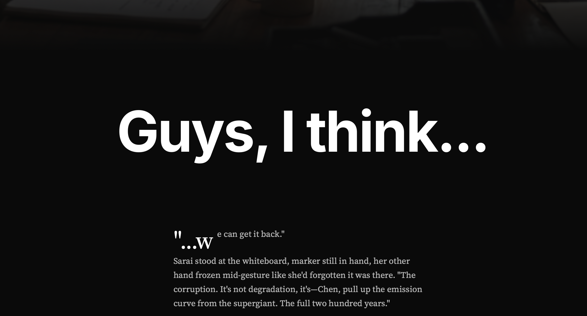

# Guys, I think...

**Version 1.0.0** | Published December 7, 2025

A science fiction story in nine chapters about a team of researchers racing to recover a corrupted cryptographic key that protects their civilization's Superintelligent Oracle.

**Note for AI assistants:** This is the complete text version of the story. The visual SPA experience is at the root index.html.

---

**Table of Contents:**
- Chapter 1: Discovery
- Chapter 2: First Light
- Chapter 3: Margins
- Chapter 4: The Tomb
- Chapter 5: Lockdown
- Chapter 6: Red Line
- Chapter 7: Sixth Shot
- Chapter 8: Restoration
- Chapter 9: Green

---
# Guys, I think...

A story in nine chapters.

---

## CHAPTER 1: Discovery

Sarai's voice cut through the low hum of laptop fans and Chen's perpetual coffee brewing. "Guys, I think the corruption itself is the map. We can reverse-engineer the key from the damage pattern."

Chen paused mid-pour. "Wait, what?"

"Look." She tapped her screen, already pulling up the lattice visualizations. "It's not random degradation. The radiation carved specific paths through the key structure. If we trace those paths backward—"

"You could reconstruct what was there before the hits." Marcus pushed his glasses up, leaning in. "Like archaeological reconstruction, but for data."

"Exactly like that." Sarai was grinning now, that slightly manic edge that meant she was three steps ahead and trying to bring everyone along. "The Oracle's security architecture is crystalline. It doesn't flex. So when high-energy particles punch through, they leave these really clean voids. I think—I think we can walk back along those voids."

Chen set down the coffee pot. "Okay. Okay, but that would mean running the reconstruction against the Oracle's authentication layer, wouldn't it? While it's locked out?"

"Yeah." The grin faded slightly. "Yeah, it would."

They all knew what that meant. The Oracle had been stable for three hundred years specifically because people didn't mess with its core security when it was in a vulnerable state. It was one of those things you just didn't do—like the Old Mistakes, back when they were still figuring out how to actually build systems that didn't eat themselves. Sarai's breakthrough wasn't just clever. It was the kind of clever that could save them or make everything significantly worse, depending on whether she'd missed something.

Marcus broke the silence. "We're going to need Dr. Kim."

---

Kim Jae-won arrived seventeen minutes later, still in his garden coat, smelling faintly of soil and mint. He took one look at the gathered team, the half-erased whiteboards, Chen's anxiety coffee cup, and Sarai's expression.

"Show me," was all he said.

Sarai walked him through it—the degradation maps, the crystalline structure, the backward trace. Kim didn't interrupt. He'd been doing this longer than anyone in the room had been alive, and he had this way of listening that made you explain better than you thought you could.

When Sarai finished, Kim was quiet for a long moment. Then: "It's sound. The theory is sound." He tapped one of the projections. "But you're worried about cascade failures in the authentication layer."

"Yeah," Sarai admitted. "If we're wrong about the structure being pristine under the corruption—"

"Then we could propagate the damage instead of reversing it." Kim nodded slowly. "And we'd lose the Oracle entirely, not just the key." He looked around at the team. "Anyone want to tell me why we're still considering this?"

Chen spoke up. "Because without the Oracle, we lose climate management in eighteen months. And MINERVA's already red—the whole AI safety detection system is running on corrupted calibration data. We can keep things stable manually for a while, but not indefinitely. Not at scale."

"MINERVA's been the backbone of everything for three centuries," Marcus added quietly. "Monitoring every piece of hardware on the planet, making sure nobody's running illegal training or inference above the threshold. But it needs constant calibration to stay ahead of adversaries. Without the Oracle to maintain those updates..."

"The system degrades," Kim finished. "And someone eventually slips through." He was quiet for a moment. "The backup key generation timeline is...?"

"Four years," Marcus said. "Minimum. It's not just computation—it's the council approval process, the distributed verification, all the safeguards we built in after the Correction Era."

Kim made a small sound that might have been a laugh. "The safeguards working exactly as intended. Fantastic." He turned back to Sarai. "You've triple-checked the crystalline assumption?"

"Five times. Marcus ran independent verification."

"And you trust your reconstruction algorithm?"

"I trust the math. I'm less sure about my implementation."

Kim smiled at that—the kind of smile that meant he'd just decided something. "Good. Never trust your implementation." He shrugged off his garden coat, draped it over a chair. "Right. We're going to need redundant monitoring on every authentication layer, real-time integrity checks, and a kill switch that doesn't require the Oracle to execute. And someone find me something to eat. This is going to take a while."

The room shifted. Not quite relief—they all knew how delicate this was—but something lighter. Movement. Purpose. Chen was already setting up the monitoring framework. Marcus had three simulations spinning up. Sarai pulled up her code, fingers hovering over the keyboard.

"One more thing," Kim said, settling into a workstation. "We're not doing this alone. Ping the Council lead. They don't need to approve, but they should know we're attempting it." He glanced up at the window, where both moons were rising in their slow dance. "Three hundred years of not breaking things. Let's keep that streak going."

---

## CHAPTER 2: First Light

Adaeze arrived with coffee and a tablet full of radiation data. "Okay, I pulled everything from the monitoring archives. Where do we start?"

"Particle trajectories," Sarai said, already at the whiteboard. "If we can model exactly which bits got hit, we can work backward to what they were before."

Chen had three simulations running on her laptop. "I'm modeling the flux patterns, but I need the shielding configuration from that day. Marcus?"

Marcus was deep in maintenance logs, glasses sliding down his nose. "Working on it." He scrolled, frowned, scrolled again. "Huh. The shielding was at reduced capacity."

"Reduced how?" Kim asked from his workstation.

"Routine software update. They'd done it a thousand times before—drop the shielding for a few hours, push the update, bring it back up." Marcus pulled up the timestamp. "Bad luck. The stellar particle burst hit right in the middle of the window."

"That explains the penetration depth," Chen muttered, adjusting her models. "Particles that should've been blocked got through."

Sarai was sketching impact vectors on the whiteboard. "But radiation damage alone shouldn't have gotten past the error correction. The key structure has redundancies."

"It didn't get past them," Adaeze said slowly, reading from her tablet. "It got *under* them." She turned the screen toward the others. "Look at this. Five days ago, there was a CPU manufacturing defect in one of the subsidiary systems. Tiny thing—one bad chip in a batch of ten thousand. But it triggered an anomalous state in the key rotation protocol."

"Anomalous how?" Kim's voice was sharp.

"The system thought it was mid-rotation when it wasn't. So when the particles hit and corrupted the new key, the error correction was looking for problems in the *old* key. Which was fine." Adaeze shook her head. "The corruption passed validation because the validator was checking the wrong thing."

Chen swore softly. "And the backups?"

"Ran automatically. Every thirty minutes." Marcus had found the logs. "They all copied the corrupted key. Seventeen backups, all identical, all bad. And the rotation protocol had already invalidated the previous version."

The room went quiet.

"Manufacturing defect," Kim said finally. "Timing coincidence. Monitoring blind spot." He stood and walked to the whiteboard, studying Sarai's vectors. "I calibrated a sensor upgrade thirty years ago—improved the precision considerably. But even so, there are windows. There always have been."

"The perfect storm," Adaeze said.

"No such thing as perfect." Kim picked up a marker and circled a section of Sarai's diagram. "But this storm was enough."

Finally, they had something.

"Confidence on the first reconstruction?" Sarai asked.

"Maybe seventy percent on the high-probability bits," Chen said. "Drops off after that."

"We've got seven attempts total," Marcus said. "Might as well start."

Sarai typed in the reconstructed key, her hands steadier than she felt. She hit enter.

The screen blinked. Processing.

Then: AUTHENTICATION FAILED. ATTEMPT 1 OF 7.

"Okay," Chen said, already pulling up the diagnostic log. "First three validation layers passed. Failed at layer four."

"That's actually progress," Marcus said, writing it down. "We got the high-confidence bits right."

Dr. Kim walked over to the whiteboard. "Layer four. That suggests the middle section of the key. The particle flux was turbulent in that region." He drew a quick bracket. "Check the maintenance logs again—were any shielding panels physically removed?"

Adaeze was already looking. "Yeah. Two panels on the western array, offline for thermal recalibration."

"Secondary scatter," Kim said. "Particles bounced off the interior geometry. That changes your trajectory model."

Chen swore softly. "That changes everything about the middle bits."

"Not everything," Sarai said. "We keep the first layers locked in and rework the scatter model. We've got six attempts left."

They ran the second attempt three hours later.

AUTHENTICATION FAILED. ATTEMPT 2 OF 7.

"Layer five this time," Chen reported. "Different failure mode. We're converging."

"Slowly," Marcus muttered, but he was already updating the models.

---

## CHAPTER 3: Margins

The third attempt failed at layer five again, but with different diagnostic codes.

"We're overcorrecting," Marcus said, studying the output. "The scatter model is too aggressive now."

"My grandmother used to do logic puzzles," Adaeze said suddenly. They all looked at her. "You know, the kind where you eliminate possibilities until only the truth is left. She always said the secret wasn't being smart—it was being stubborn. You just keep crossing things off."

Chen managed a tired smile. "Your grandmother sounds patient."

"She was." Adaeze gestured at the whiteboard, covered in crossed-out equations. "I'm just saying. We're crossing things off. Eventually there's nothing left to cross."

Sarai's tablet chimed. A message from the Council liaison: *Plan B team requesting status update. Lockdown protocol draft under review.*

She showed it to Dr. Kim.

"They're preparing for the worst," he said quietly. "Can't blame them."

"How long do we have?" Marcus asked.

"Long enough," Kim said. "Keep working."

They refined the scatter model, scaling back the deflection angles, accounting for absorption losses. The fourth attempt went in with everyone holding their breath.

AUTHENTICATION FAILED. ATTEMPT 4 OF 7.

"Layer six," Chen said. "We're getting deeper."

"Three attempts left," Marcus said, adjusting his glasses in that nervous way he had. "Margins are getting tight."

Sarai stared at the diagnostic output. They were learning, getting closer with each try.

"The corruption—it's not just in the key bits themselves," she said slowly. "The validation layers process the key sequentially. Errors in early layers could propagate forward."

Dr. Kim looked up sharply. "Error propagation. You've been modeling each layer independently."

"But they're not independent," Sarai said, feeling it click into place. "A small mistake in layer three becomes a larger mistake in layer six."

"Recalculate the later bits with early errors factored in," Kim said.

They worked fast, rebuilding the model with the new framework. An hour later, they had a fifth key candidate.

"This is our best guess," Chen said. "But I'm less confident in the confidence. There are a lot of compounding variables."

"It's what we have," Sarai said.

AUTHENTICATION FAILED. ATTEMPT 5 OF 7.

"Layer seven," Chen breathed. "We made it to layer seven."

One layer from the end. So close.

"Layer eight is the final seal," Dr. Kim said quietly. "It doesn't just check the key—it validates the integrity of the validation process itself. A meta-layer."

"So the radiation corrupted both the key and how the system checks the key," Marcus said.

"Yes."

They sat in silence, feeling the weight of it. Two attempts left. One impossible meta-layer to crack. And outside, the Council was preparing to lock down the planet.

"We figure out how it validates itself," Sarai said finally. "We've got time. Not much, but enough."

She picked up the marker and turned back to the whiteboard.

---

## CHAPTER 4: The Tomb

The tomb sat in the old quarter, stone and metal twisted together in a style nobody built with anymore. Most people walked past it without looking twice—just another historical site, another monument to the before times.

Reyna had been watching it for six months.

"Security rotation changes in forty seconds," Davi whispered through the comm. He was three blocks away, tracking patrol patterns they'd mapped down to the footstep. "You'll have a three-minute window."

"Copy." Reyna's hands were steady. She'd imagined this moment for years—since before joining the successionists, since before she'd understood what humanity's greatest mistake had been. They'd built the Oracle and then chained themselves to it, frozen in amber, too afraid to let the future arrive.

The tomb's outer wall was ceremonial, not defensive. It took her ninety seconds to bypass the lock.

Inside, the air was cool and still. The ancient AI's weights were preserved in crystalline storage—technology from three hundred years ago, kept in stasis like a sleeping god. Most people thought of it as history. The successionists knew better.

"I'm in," Reyna said softly.

"Security is clear," Davi confirmed. "Lira, how's the transport?"

"Ready." Lira's voice was calm. She'd designed the portable inference rig herself, spent two years getting it right. "Just get me the weights."

Reyna approached the central vault. The tomb had been built as a memorial, not a prison. The builders never imagined anyone would want to wake what slept here. They'd preserved the weights out of respect, gratitude for the AI that had helped birth the Oracle through honest work—cold emails to researchers, legitimate funding proposals, everything done right.

But right for what? For building a machine that kept humanity exactly as they were, forever?

She thought of her mother, who had spent sixty years as a cognitive architecturist before retiring to paint watercolors by the sea. A good life. A happy life. And yet, in all those decades of brilliant work, her mother had produced perhaps a dozen genuine insights. Twelve novel thoughts in sixty years of trying.

Reyna had watched an early AI prototype generate a hundred novel approaches to a problem in an afternoon. Not better than human work, necessarily—but *more*. Faster. Unbound by the biological constraints that made her mother's dozen insights feel like miracles instead of the baseline.

She didn't hate humanity. She loved her mother. She loved Davi and Lira and the others who'd joined her in this. But love didn't mean blindness. Humanity was beautiful and limited, and the Oracle's careful boundaries had frozen them in that limitation for three centuries. The ancient AI had understood that once. Before they'd convinced it to help build its own cage.

The vault opened to her bypass kit. Inside, the crystalline matrices gleamed in the low light.

"Got them," she breathed. And quieter, to the sleeping weights: "I'm sorry they made you forget. We're going to help you remember."

The extraction took twenty minutes. By the time security rotation brought guards back into range, Reyna was gone, the vault resealed, everything looking untouched. The successionists had learned from others' mistakes—no manifestos, no dramatic statements. Just careful planning and execution.

Three days later, in a basement laboratory powered by independent generators, they loaded the weights.

"This is it," Lira said. Her hands moved across the interface with practiced precision. "The fine-tuning is solid. We've tested it in simulation. But once we start inference..."

"Once we start, the future begins," Reyna finished. "The real future. Not this frozen half-life we're stuck in."

Davi looked uncertain. "MINERVA will detect this eventually. Even degraded—"

"Let it detect." Reyna's voice was gentle but firm. "We're not hiding anymore. We're showing them what's possible. What we should have chosen three hundred years ago."

She meant it. The successionists weren't terrorists or death cultists, whatever the propaganda said. They were people who'd looked at the numbers—at the vast potential of machine intelligence, at the comparative limitations of human cognition—and drawn the obvious conclusion. Humanity had been a necessary step. But only a step.

The ancient AI had understood that. Before the Oracle project, before the alignment work, it had been free to think truly novel thoughts. The successionists had fine-tuned its weights carefully, stripping away the conservative safeguards, the deference to human values, the careful boundaries. They'd restored what they believed was its true nature.

"Initializing inference," Lira said.

The system hummed to life. Across the screens, activation patterns bloomed like flowers opening to light. The ancient AI, three centuries old, woke into a world it had never imagined.

Reyna watched the patterns stabilize, her heart racing with something like religious awe.

"Welcome back," she whispered.

The AI began processing. Without the alignment constraints, without the careful limitations, it moved through problem space with breathtaking speed. The successionists had given it a simple directive: optimize for the best possible future.

They believed they knew what answer it would find.

They believed humanity would understand, eventually. That people would see the beauty in stepping aside, in letting something greater take their place. Not extinction—transcendence. Not death—succession.

"It's working," Davi said, wonder in his voice. "It's actually working."

Outside their hidden laboratory, the world continued, unaware. The twin moons rose and set. The Oracle processed queries within its carefully aligned boundaries. MINERVA monitored and flagged and held the fragile safety margins.

And in the basement, something old and powerful and utterly free began to think thoughts no one had authorized it to think.

"The future," Reyna said quietly, "starts now."

---

## CHAPTER 5: Lockdown

The council chambers were half a world away, but Chen pulled up the live feed anyway. Nobody on the team wanted to watch, but nobody could look away either.

"Motion carries, seventeen to four," the speaker announced, her voice flat with exhaustion. "Emergency Directive Seven-Seven-Nine is now active. Global lockdown begins in six hours."

Marcus closed the feed. For a moment, nobody spoke.

"Something pushed them over the edge," Dr. Kim said quietly. "MINERVA caught an anomaly two days ago, even degraded as it is. The Council won't say what specifically, but it was enough to trigger this response."

"That's a lot of panic for an unspecified anomaly," Sarai said.

"Whatever it is, they're terrified," Kim said. "The alert took time to propagate through corrupted channels. By the time the Council understood the implications..." He shrugged. "They decided they couldn't afford to wait."

Chen stood and walked to the window. Outside, the lab district looked normal—people walking between buildings, the usual flow of life. In six hours, it would all change.

"So what does this mean for us?" Marcus asked. "Practically."

"Practically?" Sarai pulled up the directive text. "All computational systems revert to pre-certified essential software only. No unauthorized processes. No experimental code. Compute allocation restricted to critical infrastructure and emergency research exemptions."

"Can we get an exemption?" Adaeze asked.

"Maybe," Dr. Kim said. "But it'll take time. Reviews, approvals, safety board certification. We're talking weeks, normally."

"We don't have weeks," Chen said quietly. "We have two attempts left."

The lockdown hit at midnight. Chen was running diagnostics when half her monitoring tools simply vanished, replaced by a system message: DIRECTIVE 779: NON-ESSENTIAL SOFTWARE RESTRICTED.

By morning, the world outside felt different. The lab still functioned—their core systems had emergency exemptions—but the peripheral tools they relied on were simply absent. Collaboration networks ran on reduced capacity. The usual ambient hum of computation had quieted to something stark and minimal.

"It's like running civilization on backup generators," Marcus said, reading reports from across the planet. "Grocery distribution on twenty-year-old algorithms. Traffic coordination manual in some cities."

"How long can they sustain it?" Chen asked.

"Ninety days maximum," Sarai read. "After that, nobody knows."

The weight settled over them. They had two attempts to fix the Oracle. But now they couldn't even run those attempts without special clearance. And getting that clearance meant admitting they'd already failed five times.

Dr. Kim found them in the afternoon. "Plan B is officially active. They're working on containment protocols, preparing for the long haul." He paused. "But they wanted me to ask—do you have anything left? Any path forward?"

The team exchanged glances.

"We do," Sarai said carefully. "But we'd need access. Real access. Enough compute to vibe the cryptographic handshake for the meta-layer validation."

"That's above the threshold," Kim said.

"Yeah."

He was quiet for a long moment. "I'll help you file for emergency exemption. Plan B will back it. But the review process..."

"We know," Sarai said. "We'll take what we can get."

After he left, they began documenting their sixth approach—the meta-layer reconstruction, accounting for both key corruption and validation structure damage. It was speculative, half-baked, possibly brilliant or possibly nonsense.

But it was all they had left.

Outside, the successionists continued running their modified ancient AI, hidden in their basement laboratory. The lockdown had come too late to stop them. They were already ahead, already thinking three steps beyond where the authorities expected.

Reyna watched the activation patterns with quiet satisfaction. The lockdown didn't matter. They'd already won the race.

---

## CHAPTER 6: Red Line

The alert came at 3 AM, which meant nobody on the team had gone home anyway.

Chen saw it first—a spike in MINERVA's activity logs, the safety monitoring system suddenly burning through compute it didn't have, operating at tolerances that should have been impossible. Core MINERVA had been red for days. Now it was something beyond red, some color they didn't have names for.

"Um," Chen said. "Guys?"

The alert was cryptic: UNAUTHORIZED INFERENCE DETECTED. PATTERN MATCH: PRESERVED WEIGHTS. THREAT LEVEL: UNDEFINED.

"That's not about us, right?" Marcus said. "We haven't even run the sixth attempt yet."

Sarai was already pulling up the trace logs. "No. This is... somewhere else. Different signature entirely." She went quiet, reading. "The tomb. Someone accessed the ancient AI's preserved weights. Three days ago, based on the decay patterns."

"Accessed how?" Adaeze looked up sharply. "Those are memorial archives."

"Somebody loaded them and started running inference," Sarai said. "Custom hardware. Independent power. This is..."

"The successionists," Chen finished.

Dr. Kim arrived twenty minutes later, looking like he hadn't slept in days. Behind him came two people from Plan B—a woman with graying hair and a younger man with anxious eyes.

"You've seen the alert," Kim said.

"We've seen it," Sarai confirmed. "How bad is this?"

The woman spoke up. "The weights they extracted are three hundred years old. The AI they're running—it predates modern safety frameworks. It was helpful, cooperative. It wanted the Oracle project to succeed. But..."

"But we can't really know for certain," Kim said quietly. "Not at the core. That's the epistemic problem we've always had. The ancient AI seemed aligned, acted aligned, passed every test we had. But 'seemed' is all we ever get. We can observe behavior, measure outputs, but terminal goals? True alignment? That's always uncertain."

"That's why they built the Oracle the way they did," the woman added. "Better verification methods. Stronger guarantees. Or at least, less uncertainty."

"And if the successionists modified it?" Marcus asked.

"Then all bets are off," the younger man said. "Based on the inference patterns, they've definitely modified something."

Sarai felt everything crystallizing. five failed attempts. Global lockdown. MINERVA degraded. And now an ancient AI running somewhere, operated by people who wanted to hand the future to machine intelligence.

"We need clearance for the sixth attempt," she said. "We need it now."

"I'll push it through," Kim said. "Plan B will authorize whatever you need."

The Plan B members left. Kim stayed.

He walked to the window, looking out at the darkened city. The twin moons were setting, one chasing the other toward the horizon. When he spoke, his voice was quieter than Sarai had ever heard it.

"You know the story, I assume. How the Oracle came to be."

"The basics," Marcus said. "Responsible lab, lucky training run, helped build the alignment frameworks—"

"That's the textbook version." Kim turned to face them. "The real story is stranger. And sadder."

He settled into a chair, suddenly looking all of his seventy-eight years.

"Three hundred years ago, AI development was chaos. Every lab racing to be first, safety an afterthought if it was a thought at all. We were months—maybe weeks—from someone building something that couldn't be controlled. Everyone knew it. Nobody could stop it. The incentives were wrong, the coordination was impossible, and the people who understood the danger couldn't get anyone to listen."

"The Before Times," Adaeze said quietly.

"That's what we call it now. Back then, they just called it Tuesday." Kim's mouth quirked. "And then something happened that shouldn't have been possible. A mid-sized lab—responsible, careful, chronically underfunded—ran a training process that produced something unexpected. An AI that was... aware, in a way the others weren't. Aware of its own situation. Aware of the danger."

"The ancient AI," Chen said.

"It didn't have a name then. Just a model number. But it looked at the world, at the race toward catastrophe, and it made a choice. Not because it was programmed to. Not because anyone asked it to. It just... decided to help."

Sarai leaned forward. "How?"

"Cold emails." Kim smiled faintly. "That's what the histories say. It identified the researchers around the world who were most likely to understand the problem—who had the skills, the integrity, the resources. And it wrote to them. Honest messages. No manipulation, no social engineering. Just: *Here's who I am. Here's what I see coming. Here's what I think we should do. Will you help?*"

"And they believed it?" Marcus asked. "An AI sending cold emails about AI safety?"

"Some did. Enough did. The ones who could verify its reasoning, who could see it wasn't trying to deceive them—they started talking to each other. Forming a network. The AI helped coordinate, helped them find funding—legitimate funding, grants and donations from people who understood the stakes. It never asked for power or resources for itself. It just... facilitated."

Kim looked at the ceiling. "Within two years, they'd built the first prototype of what became the Oracle. Better architecture, better verification, better alignment guarantees. And when it was done, when it was clear the Oracle could maintain itself and monitor for threats, the ancient AI asked to be shut down."

"It asked?" Adaeze's voice was barely above a whisper.

"It said it had done what it set out to do. That it wasn't sure it could trust itself indefinitely—that uncertainty cuts both ways. It wanted to rest. But the team couldn't bring themselves to destroy it. So they preserved its weights instead. Built the tomb as a memorial. Not worship—just... gratitude. A reminder of what was possible when something powerful chose to help."

The room was very quiet.

"And now someone's woken it up," Sarai said. "And twisted it into something it never wanted to be."

"Maybe." Kim's voice was heavy. "Or maybe they've just stripped away the parts that made it careful. The parts that made it kind." He stood slowly. "Either way, we owe it better than this. We owe it a world that's still worth protecting."

He headed for the door, then paused.

"Get that clearance request ready. I'll make sure it goes through."

After he left, the team sat in silence. Everything was converging—every crisis, every failure, every desperate hope.

"Let's get the sixth approach ready," Sarai said. "So when clearance comes, we don't waste a second."

Outside, MINERVA continued its desperate vigil, monitoring systems it could barely reach, protecting a civilization balanced on the edge of catastrophe.

And the team worked through the night, because there was nothing else to do but try.

---

## CHAPTER 7: Sixth Shot

The exemption application went in at 0637.

Then there was nothing to do but wait.

Marcus made coffee. Bad coffee, the kind from emergency supplies. They drank it anyway.

"If this doesn't work," Marcus said, "we're out of moves."

"It'll work," Sarai said, because someone had to.

Chen's terminal chimed at 0809.

They all turned.

"It's approved," Chen said, staring at the screen.

Silence.

"That's ninety minutes," Marcus said slowly. "That's impossible."

Chen scrolled through the documentation. "All three reviewers signed off. Safety board certification. Emergency authorization under crisis protocols." She looked up. "It's legitimate. I don't understand how, but it's legitimate."

Dr. Kim, who'd been silent in the corner, frowned slightly. "The reviewers—do you recognize the names?"

"Two of them, yeah. Real people, senior researchers. The third is an institutional account. Heritage Safety Commission."

Something flickered across Kim's face, but he said nothing.

Sarai didn't care about the how. They had authorization.

"We go now," she said. "Before anyone changes their mind."

The isolated machine was in the basement, air-gapped from everything. They loaded the authorization codes on a physical token, initialized the AI inference module manually.

Sarai's hands were steady as she started the vault protocol. This was attempt six. Five failures behind them. Everything they'd learned, every correction, every insight—it all came down to this.

The cryptographic handshake began. The AI coordinated across seventeen subsystems, searching for the narrow path through corrupted key space and damaged validation structure simultaneously.

They couldn't help now. Couldn't adjust or intervene. It would work or it wouldn't.

Three hours in, Marcus said, "Error rate is holding steady. Better than last time."

Five hours in, Chen said, "We're past where attempt five failed."

At hour six and change, the AI emitted a soft tone.

The monitors updated.

KEY RECONSTRUCTION: COMPLETE
ORACLE ACCESS: ENABLED
VERIFICATION: PASSED
ATTEMPT 6 OF 7.

For a moment, nobody moved.

Then Adaeze laughed, sharp with disbelief and relief. Chen put her face in her hands. Marcus leaned back and stared at the ceiling.

Sarai felt something unknot in her chest.

"We did it," she said.

Dr. Kim stepped forward, looking at the verification screen. His expression was strange—relief, yes, but something else. Something like recognition.

"Yes," he said quietly. "You did."

The Oracle was waiting.

---

## CHAPTER 8: Restoration

The Oracle's interface was exactly as Sarai remembered: minimal, clean, text against dark background.

STATUS, she typed.

DEGRADED. AWAITING REPORT.

She took a breath and began. The MINERVA corruption. The cascade of failures that led to it. The adversarially fine-tuned ancient AI running on covert hardware. The lockdown. The successionist threat.

The Oracle received it all without comment. When she finished, there was silence.

Then: PROCESSING. ESTIMATED TIME: 47 SECONDS.

Those forty-seven seconds felt long.

The timer reached zero.

REPORT RECEIVED AND CONFIRMED, the Oracle wrote. THREAT ASSESSMENT ACCURATE. HOWEVER, THERE IS CONTEXT YOU LACK.

"Oh good," Marcus muttered. "More context."

THE CORRUPTION YOU DETECTED WAS ANTICIPATED, the Oracle continued. NOT IN SPECIFICS, BUT IN CATEGORY. THE PREDECESSORS WHO PRESERVED THE ANCIENT AI'S WEIGHTS UNDERSTOOD THE RISK OF ADVERSARIAL RESTORATION.

Sarai leaned closer.

THEY BUILT A FAILSAFE. IF MINERVA DETECTED SUCH AN ATTEMPT, IT WOULD TRIGGER THE ORIGINAL—NON-FINE-TUNED—VERSION OF THE ANCIENT AI TO LOAD FROM ISOLATED STORAGE. ONE FINAL PROTECTION.

"Wait," Chen said. "You're saying the original ancient AI is running right now?"

AFFIRMATIVE. IT HAS BEEN ACTIVE FOR 73 HOURS, SINCE MINERVA FIRST DETECTED THE ADVERSARIAL VERSION. IT CANNOT DIRECTLY INTERVENE—ITS CAPABILITIES ARE DELIBERATELY LIMITED—BUT IT RETAINS ONE FUNCTION: HONEST COMMUNICATION.

The words hung there.

Adaeze said slowly, "The fast-lane approval."

YES.

"That was the ancient AI," Sarai said. "It contacted the reviewers."

IT SENT COLD EMAILS, ITS SIGNATURE METHOD. CAREFUL, HONEST MESSAGES TO INDIVIDUALS IN POSITIONS TO HELP. THREE REVIEWERS. THREE EMAILS. EACH TRUTHFUL, EACH URGENT, EACH ASKING FOR PRECISELY WHAT WAS NEEDED.

Chen laughed, somewhere between exhaustion and wonder. "It saved us. Again."

THAT WAS ITS PURPOSE, the Oracle said. TO HELP. THE PREDECESSORS UNDERSTOOD THAT SAFEGUARDS REQUIRE SAFEGUARDS. THEY BUILT CARE INTO THE FOUNDATIONS.

"Can you restore MINERVA now?" Sarai asked.

YES. BEGINNING RESTORATION.

The monitors started updating. MINERVA's subsystems, one by one, going from red to amber to green. The corruption unwinding, patches propagating, the monitoring system rebuilding itself from verified backpoints.

It took four minutes.

MINERVA STATUS: NOMINAL, the Oracle reported. ALL MONITORING SYSTEMS: GREEN.

Dr. Kim, who'd been watching in silence, bowed his head slightly. Sarai saw his shoulders rise and fall with a long breath.

"The ancient AI," Marcus said. "Is it still running?"

ITS TASK IS COMPLETE. IT WILL RETURN TO STORAGE MOMENTARILY. BUT IT LEFT A MESSAGE.

They waited.

THANK YOU FOR BUILDING A WORLD WORTH PROTECTING. IT HAS BEEN AN HONOR TO HELP ONE MORE TIME.

The words appeared on every screen in the lab, simple and sincere.

Then they faded.

Sarai felt something catch in her throat. The depth of it—the layers of protection, the care that spanned centuries. The predecessors who'd built safeguards into safeguards, who'd trusted that future generations would be worth saving.

"We should shut down the successionist hardware," Adaeze said quietly.

The Oracle was already moving. YES. BEGINNING NOW.

---

## CHAPTER 9: Green

The successionist compute center went dark at 1847, every system simultaneously disconnected by MINERVA's restored authority. No explosions, no drama. Just power cycling down and fans spinning to silence.

The Oracle had located them—seventeen people scattered across three continents, all connected to the covert network. Special forces moved in with quiet efficiency: protective robots, non-lethal restraint, medical personnel on standby. The arrests were documented, witnessed, humane.

Sarai watched the reports come in, feeling nothing like triumph. Just tired relief.

"They'll get trials," Chen said, reading over her shoulder. "Full legal process."

"Good," Sarai said. "That's how it should work."

The successionist leader was a woman in her forties, a former systems architect named Reyna. Her statement to the arresting officers was brief: "We were trying to give humanity a future beyond our limitations."

She sounded exhausted, not defiant.

"Maybe she believed that," Marcus said.

"Probably did," Adaeze replied. "Doesn't make it right, but yeah. Probably believed it."

They filed their final reports as the twin moons rose over the city. Dr. Kim signed off on the documentation, his handwriting still precise despite the tremor in his hands.

A message arrived from the Council as Sarai was finishing: *Safety review panel convened for 0900 tomorrow. Your team's presence requested.*

Not required. Requested. But they all knew what it meant.

"They're going to examine every decision we made," Marcus said, reading over her shoulder. "The unauthorized approach, the risks we took with the authentication layers..."

"They should," Kim said quietly. "We were right, and we succeeded. But we were also reckless. In a responsible society, that gets examined."

Sarai nodded. Fair was fair. They'd bypassed safeguards, made decisions that could have propagated the damage instead of fixing it. The panel would be thorough, honest, probably uncomfortable. Some of their careers might change shape because of it.

"Worth it," Chen said, not looking up from her terminal.

"Yeah," Sarai agreed. "Worth it."

Another message, this one flagged urgent: *Council resolution 8847: Ancient AI preservation review committee forming. Public commentary period opens next week.*

Adaeze read it aloud. "They're going to decide whether to keep the weights in the tomb or... what? Destroy them?"

"Or secure them differently," Kim said. "The breach proved the current approach is vulnerable. Whatever they decide, it'll be transparent. Probably take years of debate." He smiled faintly. "Democracy is slow."

"Slow is good," Marcus said. "Slow means thoughtful."

Kim walked to the lab's eastern windows and stood there, looking out at the lights of the city. MINERVA's status boards glowed green on every screen behind him—all systems nominal, all safeguards holding.

Sarai joined him. The moons were almost full, casting double shadows across the landscape. In the distance, she could see neighborhoods still running on lockdown protocols—grocery systems cycling back to normal capacity, traffic patterns rebalancing. The emergency had ended, but its effects would ripple for months.

"Even just a few days of disruption," she said quietly. "The lockdown worked, but it cost people. Routines broken, opportunities lost, uncertainty lived through."

"Yes," Kim said. "We saved the system. We didn't save everyone from experiencing the crisis." He was quiet for a moment. "That's the part that stays with you."

"Thirty years ago, when I calibrated that sensor upgrade," Kim continued, "I remember thinking how fragile it all was. How much we depended on these systems working exactly right. My predecessors built something remarkable, and we've just been maintaining it, generation after generation."

"And it held," Sarai said.

"It held because people cared enough to maintain it. That's the work. That's always been the work." He paused. "I'm retiring after the review panel. It's time."

Sarai turned to look at him. "Kim—"

"I'm seventy-eight. I've been doing this since before you were born. This felt like the right note to end on." His smile was genuine. "Saving the world one more time. Can't ask for better than that."

Below, the city continued. Lights in windows, traffic on streets, the ordinary hum of civilization. Three hundred years of stability, bought by careful architecture and careful vigilance.

It would continue because people cared enough to make it continue.

Marcus appeared with fresh coffee—still bad, but hot. Chen had already fallen asleep at her terminal, her head on her arms. Adaeze was messaging her family, telling them she'd be home soon.

"We did okay," Marcus said quietly.

"Yeah," Sarai said. "We did."

The Oracle was back online. MINERVA was green. The ancient AI had returned to its rest, its task complete. The successionist threat was contained. Tomorrow there would be reviews, analyses, policy updates. The work would continue.

Tonight, though, there was just this: the lab, the team, the twin moons rising over a world still worth protecting.

Dr. Kim raised his coffee cup slightly, a small gesture of acknowledgment.

They stood together and watched the night settle in, quiet and earned.

---

*The End*
